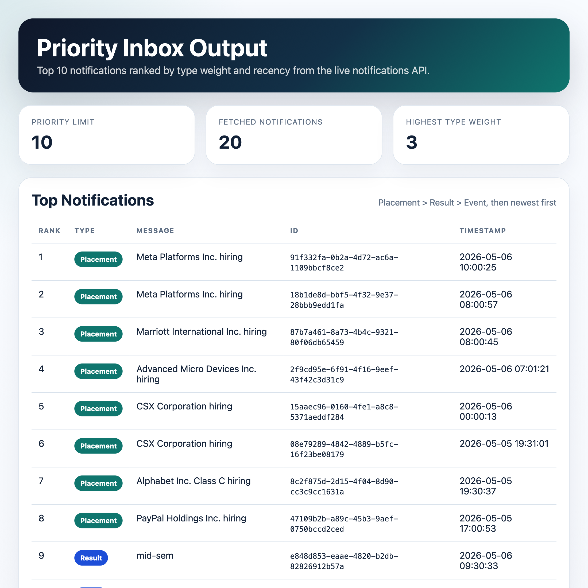

# Notification App Backend

This folder contains the priority inbox coding task for the campus notifications microservice.

## Files

- `notifications.py`: fetches notifications, computes the top `N`, and streams updates
- `runner.py`: standalone entry point for writing the top notifications JSON
- `output.json`: live generated priority inbox result
- `output.html`: formatted view used for the screenshot
- `priority_notifications_screenshot.png`: submission screenshot for Stage 6 output

## Usage

Set a fresh token first, then run:

```bash
export EVAL_ACCESS_TOKEN="your-fresh-token"
venv/bin/python notification_app_be/runner.py
```

The output will be written to `notification_app_be/output.json`.

## Screenshot


