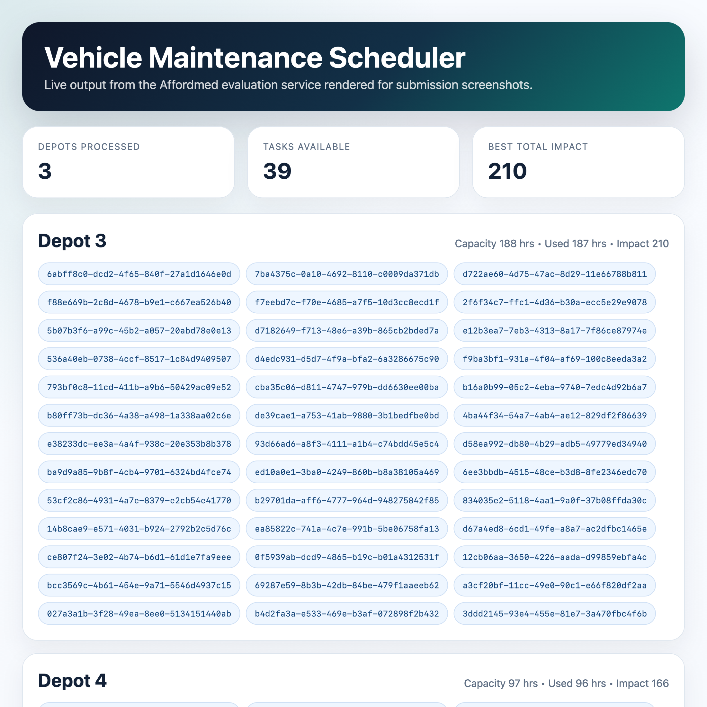

# Vehicle Maintanence Scheduling

This folder contains the vehicle maintenance scheduler deliverable.

## Files

- `service.py`: fetches depots and vehicles, then computes per-depot schedules
- `solver.py`: 0/1 knapsack implementation
- `runner.py`: standalone entry point for generating the scheduler output JSON
- `output.json`: live generated scheduler result
- `output.html`: formatted view used for the screenshot
- `vehicle_maintanence_scheduling_screenshot.png`: submission screenshot for the scheduler output

## Usage

Set a fresh token first, then run:

```bash
export EVAL_ACCESS_TOKEN="your-fresh-token"
venv/bin/python vehicle_maintanence_scheduling/runner.py
```

The output will be written to `vehicle_maintanence_scheduling/output.json`.

## Screenshot


